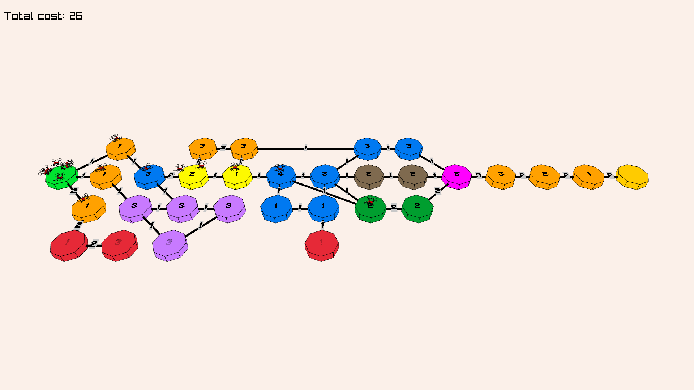
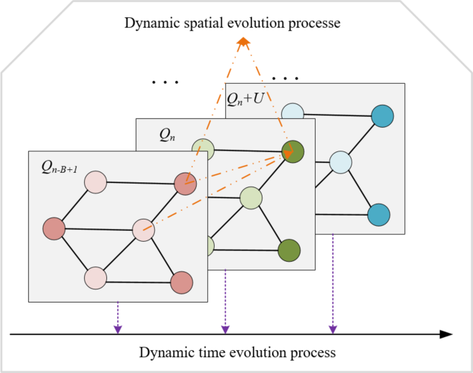
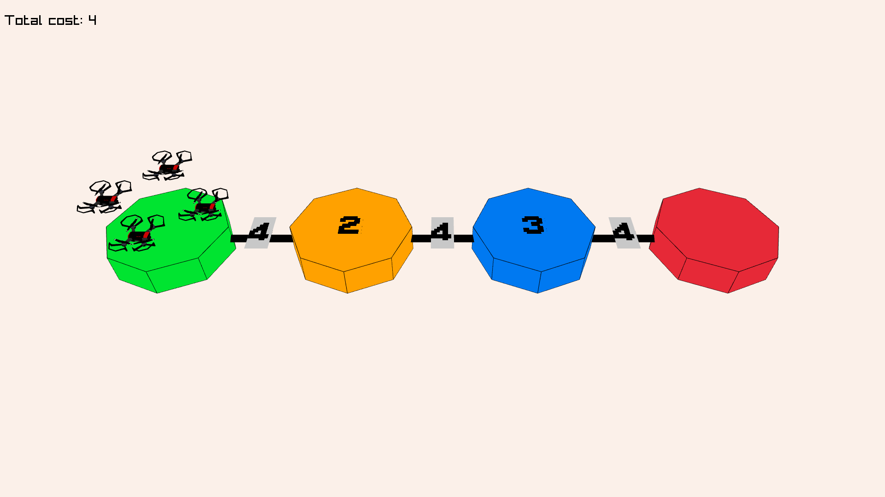
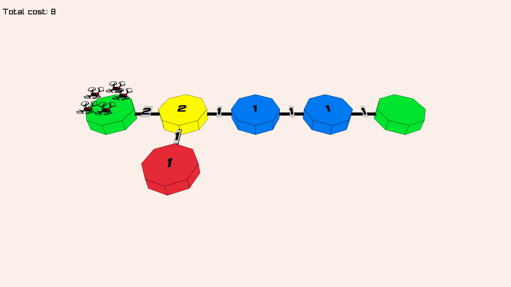
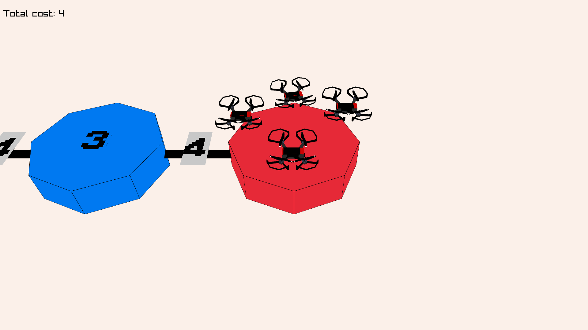
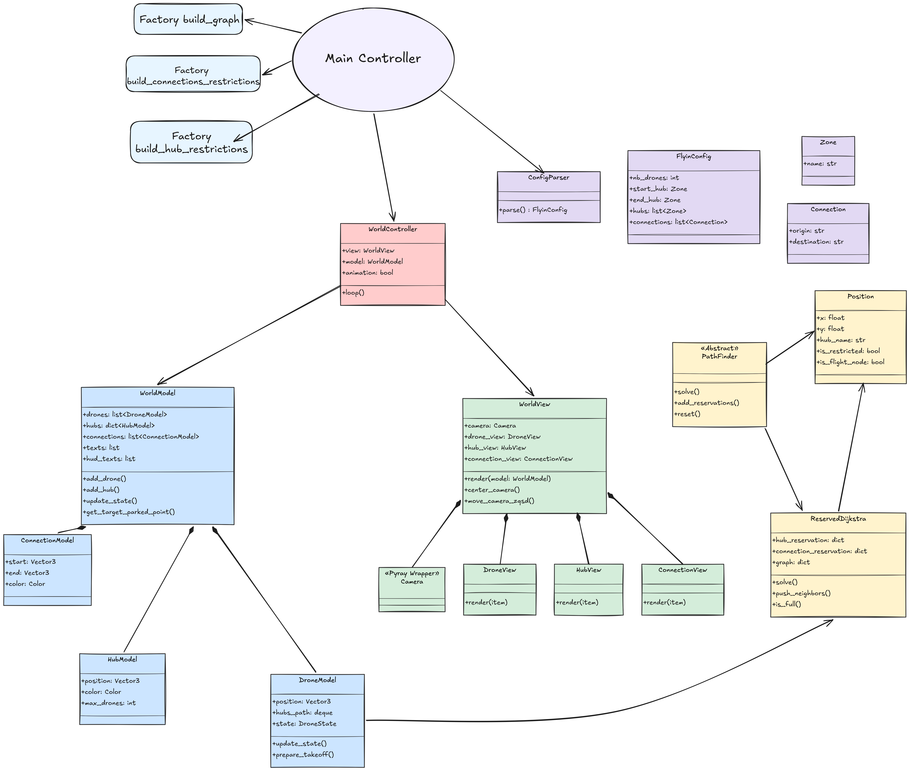

*This project has been created as part of the 42 curriculum by abounoua.*

# 🚁 Fly-in: Autonomous Drone Fleet Routing

## Description

Autonomous drones are the future of transportation, logistics, and surveillance. But as the sky gets crowded, managing a fleet of drones becomes a massive algorithmic headache. **Fly-in** is a high-performance, strictly object-oriented routing system designed to navigate multiple drones through a connected network of zones while minimizing simulation turns and rigorously avoiding collisions.

By implementing a **Cooperative Time-Expanded Dijkstra** algorithm, this project guarantees that drones respect strict physical constraints—such as zone capacities (`max_drones`) and corridor bottlenecks (`max_link_capacity`) without crashing into each other. Built entirely from scratch without external graph libraries, it features a custom 3D visualization engine using `pyray` to bring the simulation to life.

In this README, we will dive into the world of Multi-Agent Path Finding (MAPF), Graph Theory, and Object-Oriented visual simulations.

> *"Drones are interesting."*


<p align="center">
        
</p>


---

## Instructions

### Prerequisites

* Python 3.10 or higher
* [uv](https://docs.astral.sh/uv/) (Python package manager)
* `make` utility

### Installation

Clone the repository and use the provided Makefile to install all necessary dependencies via `uv`:
```bash
git clone 
cd fly-in

# Install dependencies and setup the virtual environment

make install
```

### Execution

The project provides an interactive CLI using `questionary` or accepts direct file arguments.

#### Interactive Mode:

Simply run the engine and select your map from the visually prompted list.
```bash
make run
```

#### Direct Map Execution:

Useful for quick testing:
```bash
uv run python -m src maps/03_ultimate_challenge.txt
```

#### 3D Controls

Once the Pyray window opens:

* **SPACE**: Toggle animation (play/pause drone movement).
* **RIGHT ARROW**: Step-by-step animation.
* **W/A/S/D**: Move the 3D camera.
* **UP/DOWN ARROWS**: Increase or decrease simulation speed.

#### Development & Linting

To ensure strict type safety and code quality (mandatory for the curriculum):
```bash
make lint        # Standard checks (flake8, mypy)
make clean       # Clean pycache and artifacts
```

#### Output Format

The engine visually simulates the flight but also prints the step-by-step movements to the standard output as required.
```text
D1-roof1 D2-corridorA
D1-roof2 D2-tunnelB
D1-goal D2-goal
```

#### Map Configuration

To understand how the simulation parses the world, here is an example of a map file syntax. The engine uses a custom parser backed by Pydantic to ensure logical integrity (e.g., checking that the start hub can actually hold the number of drones).

`maps/01_linear_path.txt`
```text
Easy Level 1: Simple linear path

nb_drones: 2

start_hub: start 0 0
hub: waypoint1 1 0 [color=blue]
hub: waypoint2 2 0 [color=blue]
end_hub: goal 3 0 [color=red]

connection: start-waypoint1
connection: waypoint1-waypoint2
connection: waypoint2-goal
```

Note: Optional metadata enclosed in brackets [...] allows us to define specific hub types (like restricted or priority), colors for the 3D renderer, and specific drone capacities.

#### Project Structure

To maintain a clean and scalable codebase, the project strictly adheres to the Model-View-Controller (MVC) architectural pattern, heavily utilizing Factories and Dependency Injection.

```text
.
├── Makefile
├── pyproject.toml
├── uv.lock
├── maps/                     # Test configurations
│   ├── 01_linear_path.txt
│   └── ...
└── src/
    └── fly_in/
        ├── assets/           # 3D Models (.glb) and Fonts (.ttf)
        ├── controllers/      # MVC: Input handling & core loop
        │   └── controller.py
        ├── factories/        # Abstraction for Graph & World building
        │   ├── graph_factory.py
        │   ├── restrictions_factory.py
        │   └── world_factory.py
        ├── models/           # MVC: Data structures (Drones, Hubs, Connections)
        ├── parsing/          # Pydantic schemas & custom string parser
        ├── services/         # Core Algorithms (MAPF)
        │   ├── dijkstra.py
        │   └── pathfinder.py
        └── view/             # MVC: Pyray 3D rendering logic
```
(Note: __pycache__ directories are omitted for clarity).

---

## The Sky is a Graph: Understanding MAPF

To easily understand the core of this project, we need to introduce the concept of **Multi-Agent Path Finding (MAPF)**. Finding the shortest path for a single entity is a solved problem (thanks to Edsger W. Dijkstra). But finding the shortest path for *multiple* entities moving simultaneously without colliding is an entirely different beast.

When multiple drones share the same airspace, a standard graph (nodes and edges) is not enough. We must introduce **Time**.


<p align="center">
    
</p>
<p align="center">
    <em>Time-Expanded Graph illustrating the reservation of a node for a given turn.*</em>
</p>


### The Time-Expanded Graph

Instead of just asking "Is Hub A connected to Hub B?", the algorithm must ask "Is Hub A at Turn 3 connected to Hub B at Turn 4?".

1. **Nodes as States:** A position is no longer just `(x, y)`. It becomes a state: `(x, y, time)`.

2. **Waiting is Moving:** In a time-expanded graph, staying at the same hub for one turn is represented as a directed edge from `(Hub A, Turn T)` to `(Hub A, Turn T+1)`.

3. **Reservations:** When Drone 1 decides to move to `(Hub B, Turn 2)`, that specific spacetime coordinate is marked as *reserved*. When Drone 2 calculates its path, it sees `(Hub B, Turn 2)` as a blocked wall, forcing it to either wait or find a detour.

---

## Algorithm Explanation

Building the engine required translating these abstract concepts into a highly optimized Python architecture. Here is how the magic happens under the hood.

### 1. The Parser & Validation

Before flying, we must build the world. The `ConfigParser` reads the custom syntax file. To ensure absolute data integrity, I heavily used **Pydantic**. It validates the uniqueness of hubs, enforces capacities, and ensures the `start_hub` and `end_hub` can physically contain the requested `nb_drones`.

### 2. Graph Construction & "Flight Nodes"

The subject introduces a massive physical constraint: `restricted` zones. Moving to a restricted zone costs 2 turns, and a drone *must* arrive exactly on the second turn. It cannot wait mid-air on the connection.
To solve this elegantly without breaking the uniformity of the pathfinder's time steps, the `GraphFactory` injects synthetic 

**Flight Nodes** (`middle_point`) into the graph. This transforms a 2-turn edge into two 1-turn edges, natively solving the constraint while keeping the math clean.

### 3. Reserved Dijkstra (Cooperative Pathfinding)

The core solver is the `ReservedDijkstra` class. It extends a standard Dijkstra algorithm with a reservation table.

* **Sequential Planning:** It computes the optimal path for Drone 1, then Drone 2, etc.

* **Collision Avoidance:** During exploration, it checks `hub_reservation` and `connection_reservation` dictionaries. If an adjacent hub is at maximum capacity for `turn + 1`, the edge is treated as temporarily severed. Same method for connections, looking this time for `turn + 0`.

* **Priority Queue:** The standard minimum cost heap $O(E \log V)$ is maintained, but naturally expands into the time dimension.

### 4. The MVC 3D Engine

To separate algorithmic logic from visual rendering, the application strictly adheres to the **Model-View-Controller (MVC)** pattern.

* **Model:** `WorldModel` holds the mathematical truth stored by entity models (Drone coordinates, Hub capacities, Paths).

* **View:** `WorldView` handles the `pyray` context, the 3D Camera, and dispatches rendering to specialized sub-views (`DroneView`, `HubView`, `TextView`...).

* **Controller:** `WorldController` intercepts keystrokes, updates the Model's state (calculating real-time 3D interpolations for smooth drone movement), and triggers the View.


<table>
    <tr>
        <td align="center" width="50%">
            <br>
            <em>Easy map overview</em>
        </td>
        <td align="center" width="50%">
            <br>
            <em>Medium map overview</em>
        </td>
    </tr>
    <tr>
        <td align="center" width="50%">
            <br>
            <em>Hard map overview</em>
        </td>
        <td align="center" width="50%">
            <br>
            <em>Animated flying drones</em>
        </td>
    </tr>

</table>

---

## Design Decisions

Writing a pathfinder is math; writing a simulation engine is software engineering. To keep the codebase pristine and maintainable, several architectural choices were made:


<p align="center">
    
</p>
<p align="center">
<em>UML class diagram showing the multilayer and MVC architecture.</em>
</p>

* **Total OOP & Factory Pattern:** Everything is an object. Graph construction is abstracted behind factories (`graph_factory`, `restrictions_factory`...). This guarantees the code can easily swap graph representations or parsing logic without touching the solver.

* **Dependency Injection + Service layer:** The `build_world` function takes the solver class service (`ReservedDijkstra`) as an argument. This allows for seamless unit testing or upgrading to a different algorithm (like A*) in the future without modifying the world generation logic.


* **Graceful Error Handling:** Parsing errors explicitly point out the faulty line and cause. The engine catches exceptions to prevent nasty stack traces and exits cleanly managing all C-bindings resources from the raylib context. To ensure this, advanced python concepts such as context managers are implemented.

---

## Performance Analysis

The subject demands strict performance targets. The algorithm must route the fleet efficiently without wasting turns.

* **Speed of Execution:** Because we use Cooperative Pathfinding (Sequential Dijkstra) rather than exhaustive Conflict-Based Search (CBS), the computational time is blazingly fast. It scales linearly with the number of drones $O(D \cdot (E \log V))$.

* **Turn Optimization:** The algorithm naturally finds the shortest path for early drones. For later drones, it intelligently waits at hubs or takes minor detours to avoid congestion.

* **Benchmarks:**
* *Easy Maps (2-4 drones):* Perfectly targets $\le 6-8$ turns.
* *Medium/Hard Maps:* Effectively utilizes graph topology to distribute drones across parallel paths to prevent bottlenecking at `max_drones` boundaries.
* *Challenger Map ("The Impossible Dream"):* The sequential nature of the algorithm provides an incredibly fast and highly optimized heuristic approach to this 25-drone nightmare.


*(Note: While sequential routing is phenomenally fast and effective, finding the absolute global mathematical optimum in MAPF is an NP-Hard problem. This engine strikes the perfect balance between real-time execution and turn efficiency).*

---

## Challenges Faced

1. **The 2-Turn Restricted Zone Paradox:**
* *Issue:* The subject dictates that a drone heading to a `restricted` zone takes 2 turns and occupies the connection, unable to wait. Standard Dijkstra operates on uniform edge costs.
* *Solution:* I initially tried modifying the edge weights, but it broke the turn-by-turn simulation output. The breakthrough was implementing "synthetic flight nodes" halfway through the connection. It mathematically enforces the 2-turn transit time while natively integrating with the time-expanded reservation system.


2. **Pyray 3D Math & Memory Leaks:**
* *Issue:* Pyray is a python wrapper around a C library. Improperly handling 3D models (`load_model`, `unload_model`) leads to massive memory leaks, and managing the 3D camera vectors manually was complex.
* *Solution:* I wrapped the entire `WorldView` in a Python Context Manager (`__enter__`, `__exit__`). This guarantees that regardless of exceptions or user interrupts, the C-allocated 3D models (like the `dji_spark.glb`) are gracefully unloaded. I also implemented a custom vector normalization function for the drone's smooth facing angles (`_align_direction`).


3. **Visual Overlap (The Drone Swarm):**
* *Issue:* At the start hub, all drones spawn at the exact same `(x, y)` coordinate. In 3D space, their models clipped into a single glitchy mesh.
* *Solution:* I implemented a `discard_drones` spatial distribution function. It uses basic trigonometry (`math.cos`, `math.sin`) to calculate equidistant points on a circle around the hub, dynamically spreading the drones visually while maintaining their logical position.


---

## Resources

* **Graph Theory & MAPF:**
* [Multi-Agent Pathfinding: Definitions, Variants, and Benchmarks](https://arxiv.org/abs/1906.08291) — Excellent whitepaper to understand the theoretical limitations and approaches of MAPF.
* [Red Blob Games: Introduction to A* and Dijkstra](https://www.redblobgames.com/pathfinding/a-star/introduction.html) — The absolute best visual guide to pathfinding algorithms.


* **Python & Visualization:**
* [Raylib Documentation](https://www.raylib.com/cheatsheet/cheatsheet.html) — The underlying C library for Pyray. Crucial for understanding the 3D camera math and model rendering.
* [Pydantic Validation](https://www.google.com/search?q=https://docs.pydantic.dev/latest/) — For creating bulletproof parsers and schemas.


* **AI Usage:** *Gemini* was used only to brainstorm, agregate documentations and while understanding hard concepts such as graph temporality, 3d vectors transformations... 

*All code has been written by human for human.*